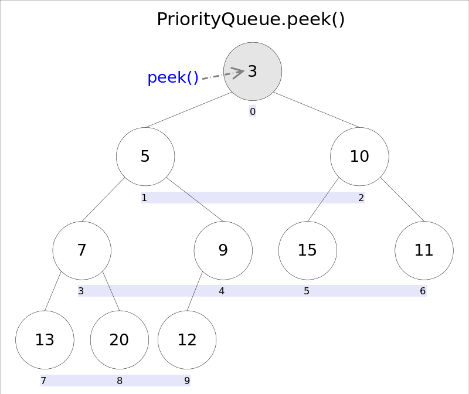
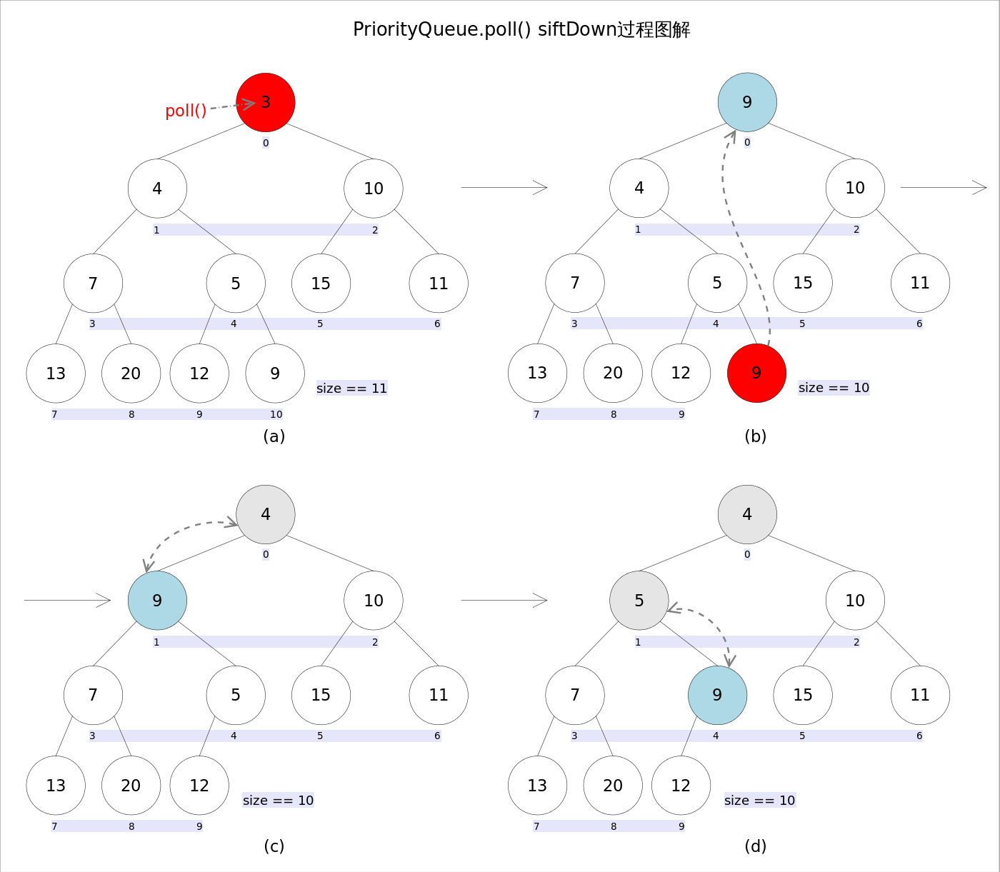

# PriorityQueue

PriorityQueue类在Java1.5中引入并作为 Java Collections Framework 的一部分。PriorityQueue是基于优先堆的一个无界队列，这个优先队列中的元素可以默认自然排序或者通过提供的Comparator（比较器）在队列实例化的时排序。

优先队列不允许空值，而且不支持non-comparable（不可比较）的对象，比如用户自定义的类。优先队列要求使用Java Comparable和Comparator接口给对象排序，并且在排序时会按照优先级处理其中的元素。

优先队列的头是基于自然排序或者Comparator排序的最小元素。如果有多个对象拥有同样的排序，那么就可能随机地取其中任意一个。当我们获取队列时，返回队列的头对象。

优先队列的大小是不受限制的，但在创建时可以指定初始大小。当我们向优先队列增加元素的时候，队列大小会自动增加。

PriorityQueue是非线程安全的，所以Java提供了PriorityBlockingQueue（实现BlockingQueue接口）用于Java多线程环境。

## 实现原理

Java中PriorityQueue通过二叉小顶堆实现，可以用一棵完全二叉树表示（任意一个非叶子节点的权值，都不大于其左右子节点的权值），也就意味着可以通过数组来作为*PriorityQueue*的底层实现。

## 方法剖析

###  add()和offer()

`add(E e)`和`offer(E e)`的语义相同，都是向优先队列中插入元素，只是`Queue`接口规定二者对插入失败时的处理不同，前者在插入失败时抛出异常，后则则会返回`false`。对于*PriorityQueue*这两个方法其实没什么差别。

新加入的元素可能会破坏小顶堆的性质，因此需要进行必要的调整。

###  element()和peek()

element()和peek()的语义完全相同，都是获取但不删除队首元素，也就是队列中权值最小的那个元素，二者唯一的区别是当方法失败时前者抛出异常，后者返回null。根据小顶堆的性质，堆顶那个元素就是全局最小的那个；由于堆用数组表示，根据下标关系，0下标处的那个元素既是堆顶元素。所以直接返回数组0下标处的那个元素即可。

### remove()和poll()

`remove()`和`poll()`方法的语义也完全相同，都是获取并删除队首元素，区别是当方法失败时前者抛出异常，后者返回`null`。由于删除操作会改变队列的结构，为维护小顶堆的性质，需要进行必要的调整。

在当前的调整中，调整策略是这样的-> 从当前节点开始，同自己的左右节点相比较，找到左右节点中**较小**的那一个进行交换。直到当前节点小于任何一个左右节点为止。

### remove(Object o)

remove(Object o)方法用于删除队列中跟o相等的某一个元素（如果有多个相等，只删除一个），该方法不是Queue接口内的方法，而是Collection接口的方法。由于删除操作会改变队列结构，所以要进行调整；又由于删除元素的位置可能是任意的，所以调整过程比其它函数稍加繁琐。具体来说，remove(Object o)可以分为2种情况：1. 删除的是最后一个元素。直接删除即可，不需要调整。2. 删除的不是最后一个元素，从删除点开始以最后一个元素为参照调用一次siftDown()即可。此处不再赘述。
