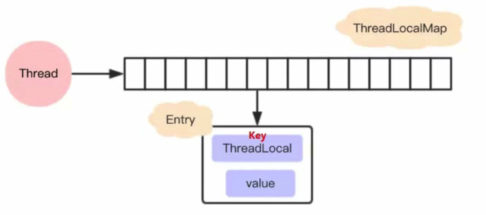
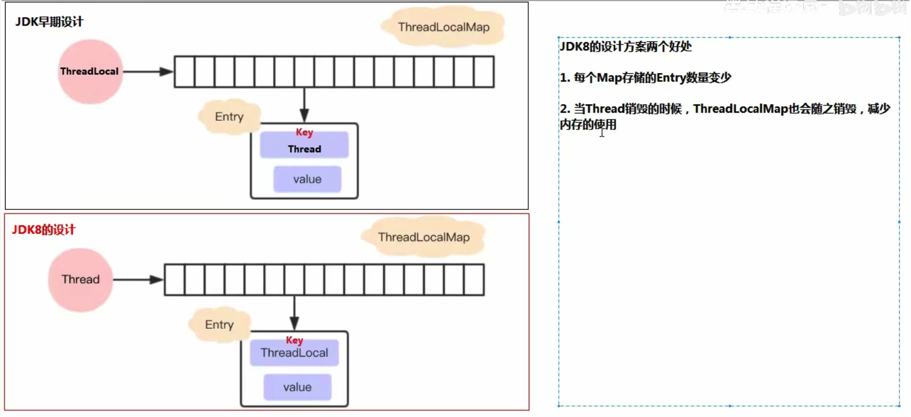

# ThreadLocal

ThreadLocal类用来提供线程内部的局部变量，这种变量在多线程环境下访问（通过get和set的方式访问）时能够保证各个线程的变量相对独立于其他线程内的变量。ThreadLocal实例通常来说都是private static类型的，用于关联线程和线程上下文。

我们可以得知ThreadLocal的作用是：提供线程内的局部变量，不同的线程之间不会相互干扰，这种变量在线程的周期内起作用，减少同一个线程内多个函数或组件之间一些公共变量传递的复杂度。

## 总结

+ 线程并发：在多线程并发的场景下。
+ 传递数据：我们可以通过ThreadLocal在同一个线程下，不同组件之间传递公共变量。
+ 线程隔离：每个线程的变量都是互相独立的不会互相影响。

### ThreadLocal的基本使用

```java
package org.cuit.threadLocal;

/**
 * @Author dailinfeng
 * @Description TODO
 * @Date 2022/1/3 1:45 PM
 * @Version 1.0
 */
public class Mydemo01 {
    ThreadLocal<String> t1 = new ThreadLocal<>();
    private String content;

    public String getContent() {
        return t1.get();
    }

    public void setContent(String content) {
//        this.content = content;
        t1.set(content);
    }

    public static void main(String[] args) {
        Mydemo01 mydemo01 = new Mydemo01();
        for (int i = 0; i < 5; i++) {
            Thread thread = new Thread(new Runnable() {
                @Override
                public void run() {
                    mydemo01.setContent(Thread.currentThread().getName()+"的数据");
                    System.out.println("------------------------");
                    System.out.println("---------"+Thread.currentThread().getName()+"--->"+mydemo01.getContent());
                }
            });
            thread.start();

        }

    }
}

```

## ThreadLocal和synchronized的区别

虽然Threadlocal模式与synchronized关键字都用于处理多线程并发访问变量的问题，不过两者处理问题的角度和思路不同

|        | synchronized                                                 | Threadlocal                                                  |
| ------ | ------------------------------------------------------------ | ------------------------------------------------------------ |
| 原理   | 同步机制采用‘以时间换空间’的方式，只提供了一份变量，让不同的线程排队去访问 | ThreadLocal采用’以空间换时间‘的方式为每一个线程都提供了一份变量的副本，从而实现同时访问而不互相干扰 |
| 侧重点 | 多个线程之间访问资源的同步                                   | 多个线程中让每个线程之间的数据都互相隔离                     |

 ## Thread Local的设计

在JDK8中，Thread Local的设计是：每个Thread维护一个Thread LocalMap，这个Map的key是Thread Local实例本身，value才是真正要存储的值Object。具体的过程是这样的：

	1. 每个Thread线程内部都有一个Map（ThreadLocalMap）
	1. Map里面存储ThreadLocal对象（key）和线程的变量副本（value）
	1. Thread内部的Map是由ThreadLocal维护的，由Thread Local负责向map获取和设置线程的变量值。
	1. 对于不同的线程，每次获取副本值时，别的线程并不能获取当前线程的副本值，形成了副本的隔离，互不干扰。




ThreadLocal的数量肯定是小于Thread的




## Thread Local的核心方法源码

基于Thread Local的内部结构，我们继续分析他的核心方法源码，更深入的了解其操作原理。除了构造方法之外，ThreadLocal对外暴露的方法有以下四个：

| 方法申明                   | 描述                         |
| -------------------------- | ---------------------------- |
| protected T initialValue() | 返回当前线程局部变量的初始值 |
| public void set(T value)   | 设置当前线程绑定的局部变量   |
| public void remove()       | 移除当前线程绑定的局部变量   |
| public T get()             | 获取当前线程绑定的局部变量   |

### threadlocal使用的是弱引用

无论Thread LocalMap中的key使用那种类型引用都无法避免内存泄漏，跟使用弱引用没有关系。要避免内存泄漏有两种方式：

1. 使用完Thread Local，调用其remove方法，删除对应的Entry
2. 使用完Thread Local，当前Thread也随之运行结束

相对于第一种方式，第二种方式显得更加不好控制，特别是使用线程池的时候，线程结束是不会销毁的。也就是说，只要记得在使用完Threadlocal及时的调用remove，无论key是强引用还是弱引用都不会有问题，那为什么key要使用弱引用呢？

事实上，在ThreadLocalMap中set/getEntry方法中会对key为null（也就是Thread Local为null）进行判断，如果为null的话，那么对value置为null的

这就意味着使用完ThreadLocal，CurrentThread依然运行的前提下，就算忘记调用remove方法，弱引用比强引用可以多一层保障；弱引用的ThreadLocal会被回收，对应的value在下一次Thread LocalMap调用set、get、remove中的任一方法的时候会被清除，从而避免内存泄漏。


## ThreadLocal核心场景介绍

ThreaLocal作用在每个线程内都都需要独立的保存信息，这样就方便同一个线程的其他方法获取到该信息的场景，由于每一个线程获取到的信息可能都是不一样的，前面执行的方法保存了信息之后，后续方法可以通过ThreadLocal可以直接获取到，避免了传参，这个类似于全局变量的概念。比如像用户登录令牌解密后的信息传递、用户权限信息、从用户系统中获取到的用户名


如上图所示，就好比如线程A的方法一创建了变量A，方法二是跟方法一在同一个线程内，那么创建的变量A就是共享的。

```java
#用户微服务配置token解密信息传递例子
public static ThreadLocal<LoginUser> threadLocal = new ThreadLocal<>();
                LoginUser loginUser = new LoginUser();
                loginUser.setId(id);
                loginUser.setName(name);
                loginUser.setMail(mail);
                loginUser.setHeadImg(headImg);
                threadLocal.set(loginUser);
            
后续想直接获取到直接threadLocal.getxxx就可以了

```

#### **如何使用ThreadLocal来解决线程安全的问题**

在我们平常的SpringWeb项目中，我们通常会把业务分成Controller、Service、Dao等等，也知道注解@Autowired默认使用单例模式。那有没有想过，当不同的请求线程进来后，因为Dao层使用的是单例，那么负责连接数据库的Connection也只有一个了，这时候如果请求的线程都去连接数据库的话，就会造成这个线程不安全的问题，Spring是怎样来解决的呢？

在Dao层里装配的Connection线程肯定是安全的，解决方案就是使用ThreadLocal方法。当每一个请求线程使用Connection的时候，都会从ThreadLocal获取一次，如果值为null，那就说明没有对数据库进行连接，连接后就会存入到 ThreadLocal里，这样一来，每一个线程都保存有一份属于自己的Connection。每一线程维护自己的数据，达到线程的隔离效果。

#### **ThreadLocal慎用的场景**

第一点（线程池里线程调用ThreadLocal）：因为线程池里对线程的管理都是线程复用的方法，所以在线程池里线程非常难结束，更有可能的是永远不会结束。这就意味着线程的持续时间是不可估测的，甚至会与JVM的生命周期一致。

第二点（在异步程序里）：ThreadLocal的参数传递是不可靠的，因为线程将请求发送后，不会在等待远程返回结果就继续向下运行了，真正的返回结果得到以后，可能是其它的线程在处理。

第三点：在使用完ThreadLocal，推荐要调用一下remove（）方法，这样会防止内存溢出这种情况的发生，因为ThreadLocal为弱引用。如果ThreadLocal在没有被外部强引用的情况下，在垃圾回收的时候是会被清理掉的，如果是强引用那就不会被清理。(这句话可能有点问题，是强引用也不会解决内存溢出的问题)


