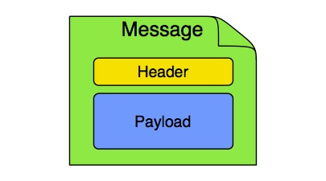

# Spring Integration

Spring Integration 解决了实时集成的问题。spring-integration是一个功能强大的EIP(Enterprise Integration Patterns)，即企业集成模式。spring-integration是一个集大成者。集成了众多功能的它，是一种便捷的事件驱动消息框架用来在系统之间做消息传递的。

spring-integration的目标

+ 提供一个简单的模型来实现复杂的企业集成解决方案
+ 为基于spring的应用添加异步的、消息驱动的行为
+ 让更多的Spring用户来使用他

### Message

 Message是它的基础构件和核心，所有的流程都围绕着Message运转，如图所示

Message，就是所说的消息体，用来承载传输的信息用的。Message分为两部分，header和payload。header是头部信息，用来存储传输的一些特性属性参数。payload是用来装载数据的，他可以携带的任何Object对象

### MessageChannel

消息管道，生产者生产一个消息到channel，消费者从channel消费一个消息，所以channel可以对消息组件解耦，并且提供一个方便的拦截功能和监控功能。

对于MessageChannel，有以下几种

+ PublishSubscribeChannel发布订阅式通道形式，多用于消息广播形式，发送给所有已经订阅了的用户。在3.x版本之前，订阅者如果是0，启动会报错或者发送的时候报错。在4.x版本后，订阅者是0，则仍然会返回true。当然，可以配置最小订阅者数量（min-subscribers）
+ QueueChannel队列模式通道，最常用的形式。与发布订阅通道不同，此通道实现点对点式的传输方式，管道内部是队列方式，可以设置管道的容量，如果内部的消息已经达到了最大容量，则会阻塞住，直到队列有时间，或者发送的消息被超时处理。
+ PriorityChannel优先级队列通道，我的理解为QueueChannel的升级版，可以无视排队，根据设置的优先级直接插队。（壕无人性）
+ RendezvousChannel前方施工，禁止通行！这个是一个强行阻塞的通道，当消息进入通道后，通道禁止通行，直到消息在对方通道receive()后，才能继续使用。
+ DirectChannel 最简单的点对点通道方式，一个简单的单线程通道。是spring-integration的默认通道类型
+ ExecutorChannel多线程通道模式，开启多线程执行点对点通道形式。

