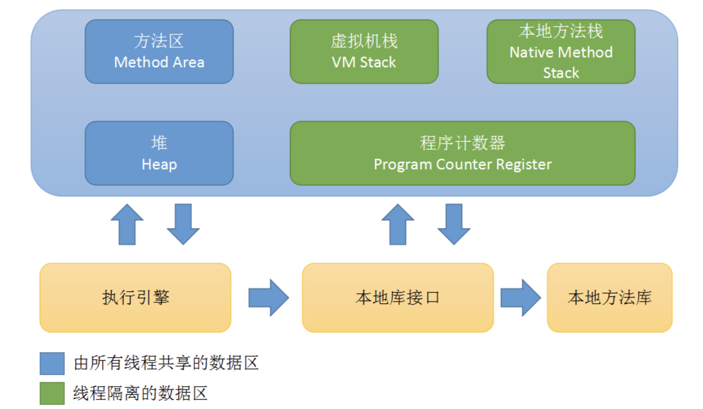

# 虚拟机和垃圾回收

## 虚拟机及其构成💻

虚拟机（JVM，Java Virtual Machine）一个完全隔离环境中的完整的计算机系统。Java虚拟机对字节码（class）进行解释生成对应平台的机器码并执行。

1. 程序计数器

   程序计数器是较小的一块内存空间，它的作用可以看作是当前线程所执行的字节码的行号指示器。每个线程都有一个独立的程序计数器，各条线程之间的计数器互不影响，独立存储，是线程私有内存。

2. Java虚拟机栈和本地方法栈

   本地方法栈和虚拟机栈所发挥的作用是非常相似的，区别是虚拟机栈执行Java方法，而本地方法栈则为虚拟机使用的[Native方法](./单个知识点解释/Native.md)服务，在sun hostpot中已经把两者合二为一了，本地方法栈区也会抛出StackOverFlowError和OutOfMemoryError异常。

3. Java堆

   Java堆是垃圾收集器管理的主要区域，因此很多时候也被称为GC堆，Java堆是被所有线程共享的一块内存区域，在虚拟机启动的时候创建。此区域的唯一目的就是存放对象实例，几乎所有对象的实例都在这里分配内存。

4. 方法区

   方法区和Java堆一样，是各个线程共享的内存区域，它用于存储已被虚拟机加载的泪信息、常量、静态变量。即时编译器编译后的代码等数据。

## 垃圾回收♻️

​	Java引入了垃圾回收机制（Garbage Collection），提升工作效率。

   **分代垃圾回收机制**，是基于这样一个事实：不同的对象的生命周期是不一样的。因此，不同生命周期的对象可以采取不同的回收算法以便提高回收效率。我们将对象分为三种状态，年轻代、老年代、持久代。同时，将处于不同状态的对象放到堆中的不同区域。JVM将堆内存划分为 Eden、Survivor和Tenured/Old空间。

​	1. 年轻代：所有新生成的对象首先都是放在Eden区。年轻代的目标就是尽可能快速的收集掉那些生命周期短的对象，对应的是Minor Gc，每次Minor Gc 会清理年轻代的内存，算法采用效率较高的复制算法，频繁的操作，但是会浪费内存空间。当“年轻代”区域存放满对象后，就将对象存放到年老代区域。

