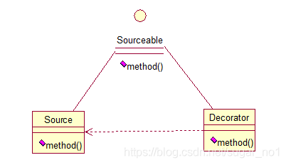

# 装饰模式

顾名思义，装饰模式就是给一个对象增加一些新的功能，而且是动态的，要求装饰对象和被装饰对象实现同一个接口。装饰对象持有被装饰对象的实例，关系图如下：



Source类是被装饰类，Decorator类是一个装饰类，可以为Source类动态的添加一些功能，代码如下：

```java
public interface Sourceable {
	public void method();
}
```

```java
public class Source implements Sourceable {
 
	@Override
	public void method() {
		System.out.println("the original method!");
	}
}
```

```java
public class Decorator implements Sourceable {
 
	private Sourceable source;
	
	public Decorator(Sourceable source){
		super();
		this.source = source;
	}
	@Override
	public void method() {
		System.out.println("before decorator!");
		source.method();
		System.out.println("after decorator!");
	}
}
```

测试类：

```java
public class DecoratorTest {
 
	public static void main(String[] args) {
		Sourceable source = new Source();
		Sourceable obj = new Decorator(source);
		obj.method();
	}
}
```

输出：

before decorator!
the original method!
after decorator!

装饰器模式的应用场景：

1. 需要扩展一个类的功能。
2. 动态的为一个对象增加功能，而且还能动态撤销。（继承不能做到这一点，继承的功能是静态的，不能动态增删。）

缺点：产生过多相似的对象，不易排错！