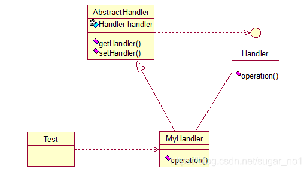

# **责任链模式（Chain of Responsibility）**

职责链（Chain of Responsibility）模式：把请求从链中的一个对象传到下一个对象，直到请求被响应为止。通过这种方式去除对象之间的耦合。发出者并不清楚到底最终那个对象会处理该请求，所以，责任链模式可以实现，在隐瞒客户端的情况下，对系统进行动态的调整。先看看关系图：



Abstracthandler类提供了get和set方法，方便MyHandle类设置和修改引用对象，MyHandle类是核心，实例化后生成一系列相互持有的对象，构成一条链。

```java
public interface Handler {
	public void operator();
}
```

```java
public abstract class AbstractHandler {
	
	private Handler handler;
 
	public Handler getHandler() {
		return handler;
	}
 
	public void setHandler(Handler handler) {
		this.handler = handler;
	}
	
}
```

```java
public class MyHandler extends AbstractHandler implements Handler {
 
	private String name;
 
	public MyHandler(String name) {
		this.name = name;
	}
 
	@Override
	public void operator() {
		System.out.println(name+"deal!");
		if(getHandler()!=null){
			getHandler().operator();
		}
	}
}
```

```java
public class Test {
 
	public static void main(String[] args) {
		MyHandler h1 = new MyHandler("h1");
		MyHandler h2 = new MyHandler("h2");
		MyHandler h3 = new MyHandler("h3");
 
		h1.setHandler(h2);
		h2.setHandler(h3);
 
		h1.operator();
	}
}
```

输出：

h1deal!
h2deal!
h3deal!

此处强调一点就是，链接上的请求可以是一条链，可以是一个树，还可以是一个环，模式本身不约束这个，需要我们自己去实现，同时，在一个时刻，命令只允许由一个对象传给另一个对象，而不允许传给多个对象。